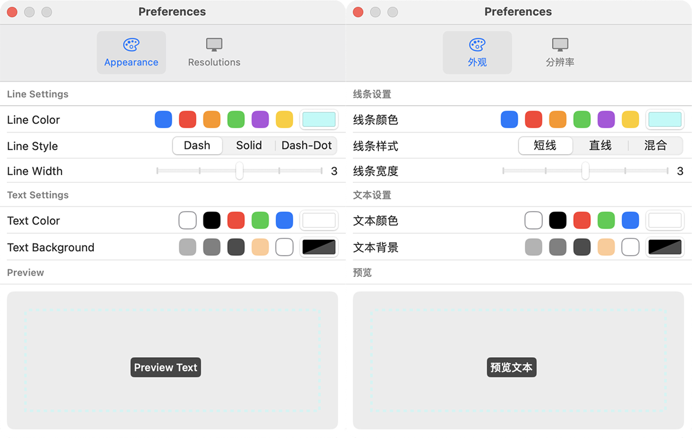
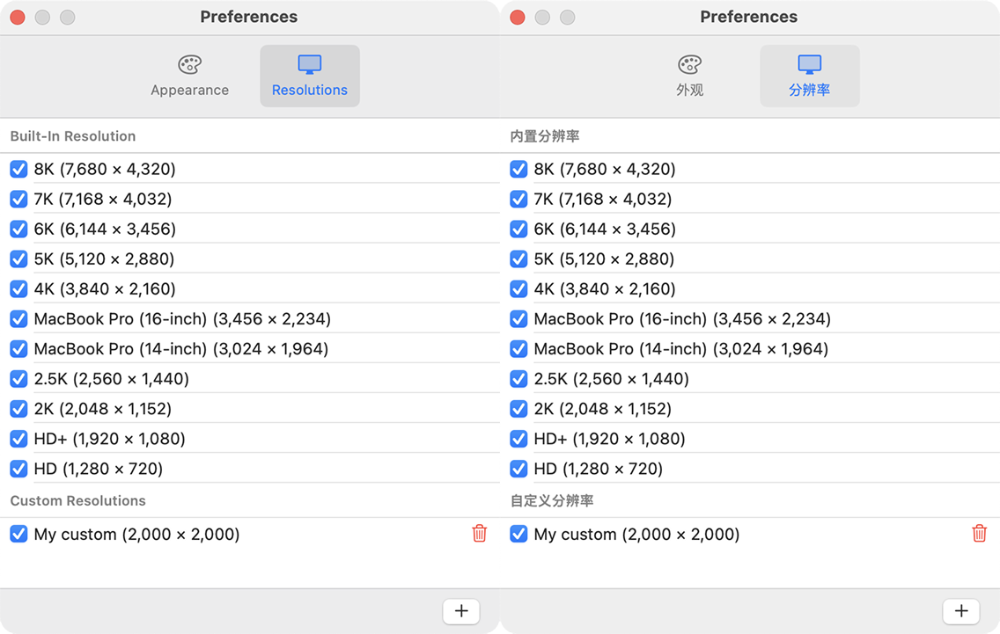

# ResoLine

ResoLine is a professional screen resolution assistant tool to help you visually preview and compare the actual display of different resolutions on your screen.

## Install Resoline

## Features

### Localization

Simplified Chinese and English are currently supported.

### Customize the look

You can customize:
+ For lines: line type / color / thickness.
+ For preview text: font color / background color / transparency.

### Custom resolutions

The system already has some common resolutions built in, you can also add custom resolutions as needed.
